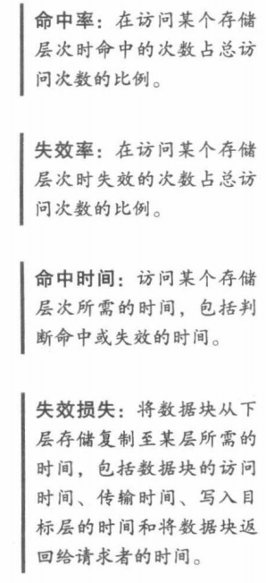
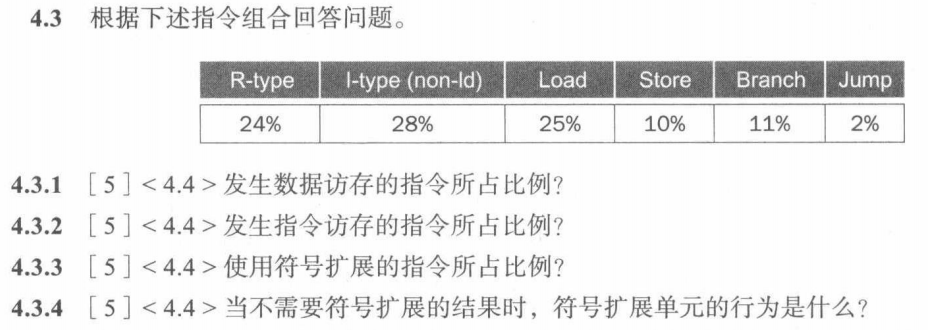
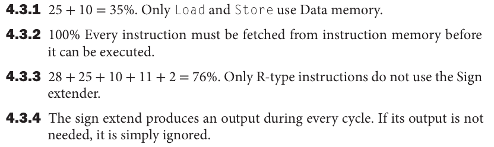
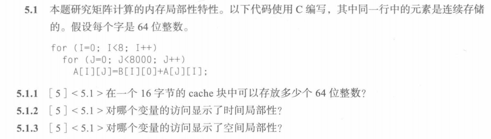
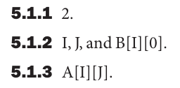
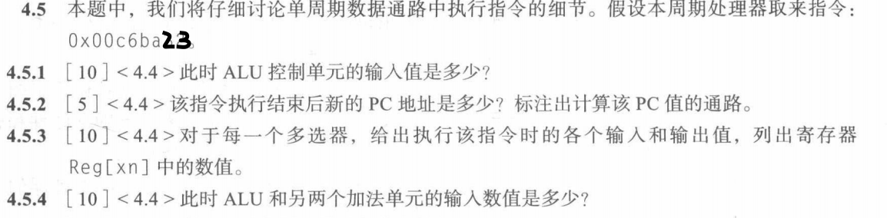
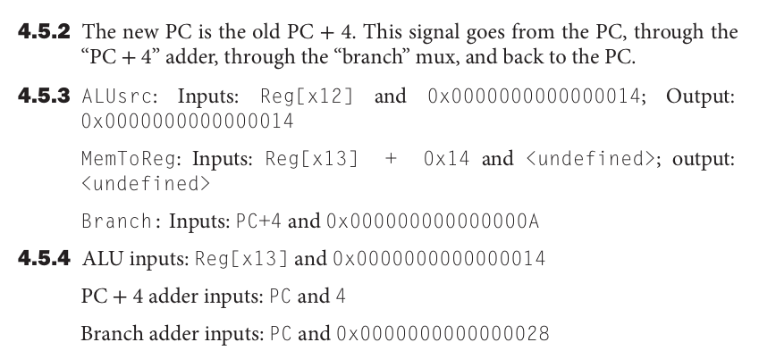
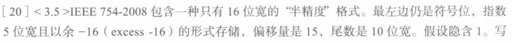
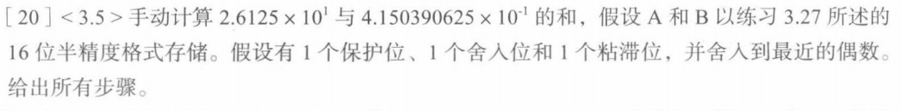
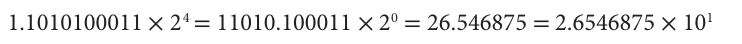

# 2021秋软件工程机组试卷（凭记忆）

1. 判断题9题（18）

 静态RAM的静态代表的是否是数据断电后数据不会消失

2. 填空题

 什么技术会在晶体管中定期刷新？<u>DRAM</u>

 舍入有+∞舍入，<u> -∞舍入 </u>，<u> 就近舍入 </u>，<u> 朝0舍入 </u>

 科学计数法是小数点左边有<u> 1 </u>位的表示方法，最左侧没有前导0的表示方法叫做<u> 科学计数法规格化 </u>

 控制器中负责运算组件的叫<u>ALU</u>
 

3. 简答题

 risc-v为什么可以流水化

 简述浮点加法的操作过程

 失效损失
 命中率
 失效率
 命中时间 
 

4. 计算题

 1、

 题目

 答案 
 
 

 2、

 题目
 
 答案
 
 

 3、

 题目

 答案

 

 4、

 题目
 

 答案

